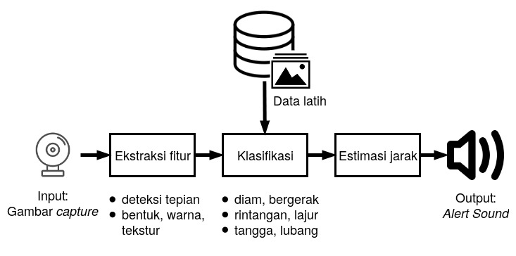

# Prototipe Pendeteksi Rintangan melalui Pendekatan Citra Digital

## PENDAHULUAN

### Latar Belakang

Setiap individu selalu berinteraksi terhadap lingkungan dalam setiap aktivitasnya. Salah satunya saat berjalan, manusia umumnya mengidentifikasi objek di sekitarnya sebelum menentukan arah geraknya. Hal ini kerap menjadi kesulitan bagi beberapa orang utamanya penyandang tuna netra.

Salah satu pendekatan yang dapat dilakukan adalah dengan pemanfaatan teknologi penginderaan komputer (computer vision). Rajput et al. (2014) telah meneliti dan mengembangkan Smart Object Detector (SOD) berupa tongkat yang menggunakan software MATLAB untuk memproses video secara efisien dan cepat untuk mendeteksi objek, mengkombinasikannya dengan sensor ultrasonik untuk mengukur jarak objek kemudian mengkonversinya menjadi suara dan getaran.

Yi et al. (2013) mengumpulkan data objek yang kerap dijumpai dan mengaplikasikan Speeded-Up Robust Features and Scale Invariant Feature Transform (SURF/SIFT) pada citra-citra yang dibagikan sekumpulan kamera dalam sistem jaringan untuk mengenali objek-objek tersebut.

Wang et al. (2014) mengimplementasi transformasi Hough pada kanal RGB untuk mengekstraksi garis-garis paralel citra sebagai fitur identifikasi tangga dan penyeberangan zebra cross. Objek tangga kemudian dibedakan ke dalam tangga naik dan tangga turun menggunakan pengklasifikasian SVM.

Penelitian ini bertujuan untuk membuat prototipe aplikasi pendeteksi rintangan bagi pejalan kaki utamanya penyandang tuna netra menggunakan kamera tunggal sebagai input, dan suara sebagai output. Output dapat berupa nada low tone yang bervariasi berdasarkan jenis objek dan estimasi jarak.

### Tujuan

Tujuan dari penelitian ini adalah:

1. Membuat prototipe software pendeteksi rintangan dan lajur pejalan kaki.
2. Mengukur akurasi pengenalan objek.

### Ruang Lingkup 

Ruang lingkup penelitian adalah:

1. Lokasi pengujian memiliki intensitas cahaya minimal 100 lux.
2. Objek yang diidentifikasi diklasifikasikan ke dalam objek umum seperti manusia, tangga, dan pintu. Objek selainnya dikelompokkan ke dalam objek bergerak dan objek diam.
3. Output suara berupa tone rendah yang bervariasi berdasarkan jenis dan estimasi jarak.
4. Produk yang dihasilkan adalah berupa prototipe program komputer.

### Manfaat

Hasil penelitian diharapkan dapat membantu pejalan kaki terutama penyandang tuna netra untuk dapat meningkatkan kewaspadaan dan sebagai pemandu saat berjalan.

## METODE PENELITIAN

Penelitian yang dilakukan terbagi menjadi beberapa tahapan proses.

### Analisa Kebutuhan dan Perancangan

Komponen utama yang akan digunakan pada penelitian adalah komputer / laptop dengan dukungan OpenCV dan kamera digital. Gambar 1 merupakan ilustrasi dari alat yang akan dibuat.

### Persiapan Alat dan Bahan

Kegiatan yang dilakukan pada tahap ini adalah mengumpulkan alat dan bahan yang akan digunakan pada penelitian, yakni:

1. Komputer dengan dukungan OpenCV dan C++
2. Kamera portable yang dapat dikoneksikan dengan komputer untuk live video atau dapat pula menggunakan file video yang direkam sebelumnya.
3. Persiapan data latih yang akan digunakan untuk pengenalan objek dan klasifikasi. Pada tahapan ini software yang digunakan adalah RStudio.

### Implementasi

Pada tahap ini dikembangkan produk berupa prototipe program berbasis C++ mennggunakan library OpenCV.

### Pengujian dan Evaluasi

Pengujian dilakukan untuk mengukur akurasi hasil pengenalan objek. Aplikasi berusaha:

1. mendeteksi objek yang telah didefinisikan, di antaranya: pejalan kaki, kendaraan, dan pintu
2. objek yang tidak dikenal dikategorikan menjadi objek diam, atau objek bergerak.
3. memperkirakan estimasi jarak dari posisi pengguna ke posisi objek.
4. jangkauan deteksi adalah maksimal 10 meter di depan kamera.
5. Output berupa tone rendah dengan beberapa variasi frekuensi dan tempo untuk membedakan jenis objek dan estimasi jarak.

<!--
### Jadwal Kegiatan

Penelitian ini akan dilakukan dalam 5 pekan dengan rincian kegiatan seperti tercantum pada Tabel 1.
-->
## DAFTAR PUSTAKA

1. Rajput, Daniyal et al. 2014. “Smart obstacle detector for blind person” dalam: Journal of Biomedical Engineering and Medical Imaging 1 (3), pp. 31–40. [DOI : 10.14738/jbemi.13.245](https://doi.org/10.14738/jbemi.13.245).

2. Wang, Shuihua, Hangrong Pan, Chenyang Zhang, dan Yingli Tian. 2014. “RGB-D image-based detection of stairs, pedestrian crosswalks and traffic signs” dalam: Journal of Visual Communication and Image Representation 25 (2), pp. 263–272. [DOI : 10.1016/j.jvcir.2013.11.005](https://doi.org/10.1016/j.jvcir.2013.11.005).

3. Yi, Chucai, Roberto W. Flores, Ricardo Chincha, dan YingLi Tian. 2013. “Finding objects for assisting blind people” dalam: Network Modeling Analysis in Health Informatics and Bioinformatics 2 (2), pp. 71–79. ISSN : 2192-6670. [DOI : 10.1007/s13721-013-0026-x](https://doi.org/10.1007/s13721-013-0026-x).